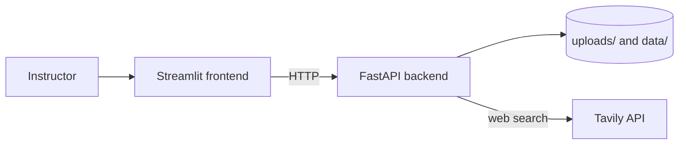
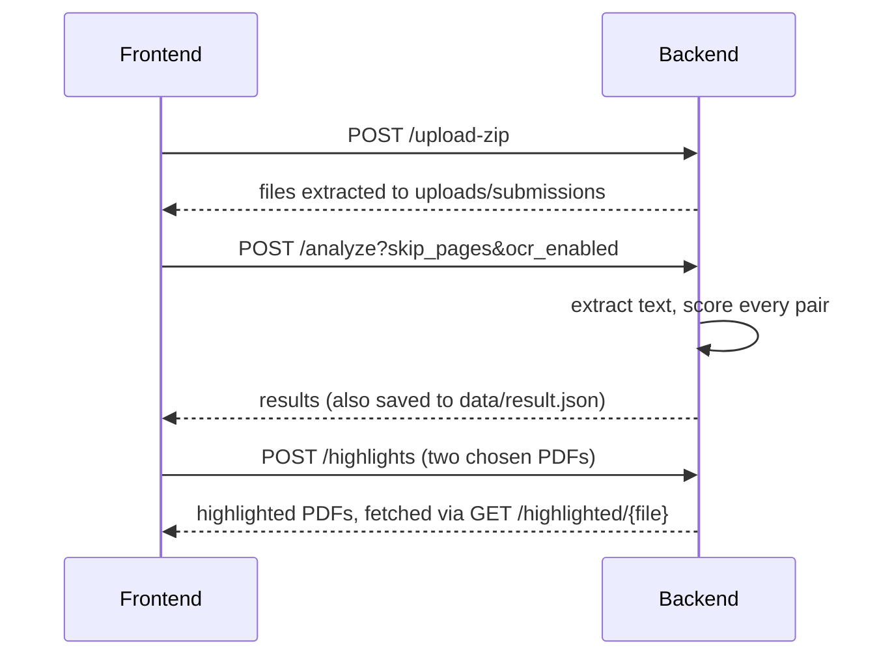

# 🏗️ Architecture

> **Written for:** developers who will maintain or extend the project.

## 🧭 Overview

The system has two services. The **frontend** (Streamlit, port 8501) is a thin UI that calls the **backend** (FastAPI, port 8000) over HTTP. The backend does all PDF processing and keeps state on disk; there is no database.

## 🔄 Workflow 1: compare a batch of submissions

1. **Upload:** the ZIP is validated, the previous batch is deleted, and the archive is extracted. Non-PDF files and macOS `._` files are removed.
2. **Text extraction:** PyMuPDF reads text, skipping the first `skip_pages` pages. With OCR on, any page with fewer than 30 characters of text is rendered and read with Tesseract. Files that are not real PDFs, or have under 10 characters of text, are skipped.
3. **Scoring:** see below. Needs at least two usable submissions.
4. **Highlighting:** done on demand for one pair at a time.

## 🧮 Scoring

Implemented in [backend/similarity.py](../backend/similarity.py). Expensive work (TF-IDF matrix, embeddings, n-grams) is computed once for the whole batch, then each pair is scored.

| Technique | How | Weight |
| --- | --- | --- |
| TF-IDF | Cosine similarity of TF-IDF vectors | 30% |
| Semantic | Cosine similarity of `all-MiniLM-L6-v2` embeddings (negative values clamped to 0) | 40% |
| N-gram | Jaccard overlap of word 3-grams | 20% |
| Exact | `SequenceMatcher` ratio on lowercase alphanumeric text | 10% |

The **final score** is the weighted sum, as a percentage. Each pair result contains `tfidf`, `semantic`, `ngram`, `exact` and `final`.

> [!NOTE]
> Exact matching compares every pair with `SequenceMatcher`, so very large batches or very long documents will be slow.

## 🖍️ Highlighting

Implemented in [backend/highlight.py](../backend/highlight.py). Words are extracted with their page coordinates, then `SequenceMatcher` finds runs of **6 or more** identical consecutive words. Matching words on the same line are grouped (a gap over 25 points starts a new group) and highlighted with PDF annotations. Output goes to `uploads/highlighted/`, and each new request clears the previous files.

## 🌐 Workflow 2: web plagiarism report

Implemented in [backend/reports.py](../backend/reports.py) and the `/api/analyze` route.

1. Reject non-PDFs, files over 25 MB and PDFs over 200 pages. Scanned PDFs without selectable text are rejected.
2. Drop the References / Bibliography / Works Cited section and everything after it.
3. Split the text into passages (up to `TAVILY_QUERY_BUDGET`, spread across pages) and search each on Tavily.
4. Merge results by URL, rank by number of matching passages, and keep up to 30 sources.
5. Keep only sources whose text can be found in the PDF, then highlight them and number them with source badges.
6. Classify matched passages by citation and quotation, count Cyrillic/Greek characters as an integrity flag, and build a report PDF.
7. Provide three downloads: report, highlighted document, and both combined.

The similarity indicator is the share of searched passages that returned a web result. It is rough evidence of overlap, not an exhaustive verdict. Only the latest run is kept; starting a new one deletes earlier files.

## 💾 Storage on disk

| Path | Contents |
| --- | --- |
| `uploads/submissions/` | Extracted PDFs of the current batch |
| `uploads/highlighted/` | Highlighted pair PDFs |
| `uploads/web/` | Uploaded PDF for the web check |
| `data/result.json` | Latest batch scores |
| `data/results/` | Web check report, highlighted and combined PDFs |

## 🖥️ Frontend

[frontend/app.py](../frontend/app.py) has three tabs: **Overview** (scores, charts and a graph of pairs above 70%), **PDF Comparison** (side-by-side highlighted PDFs) and **Plagiarism Report** (web check). [frontend/helper.py](../frontend/helper.py) holds the data helpers. Its backend address comes from the `API_URL` environment variable.

## ⚠️ Known limitations

- Backend CORS allows all origins.
- The API has no authentication, and state is global, so the app suits a single user at a time.
- Two routes are both defined with the function name `analyze` in `backend/app.py`. They still register correctly under different paths, but the shared name is easy to trip over.
