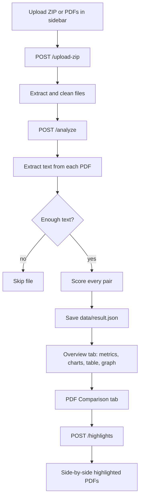
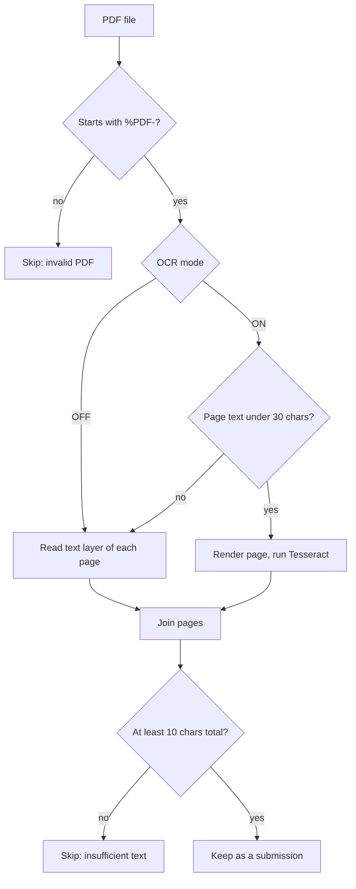
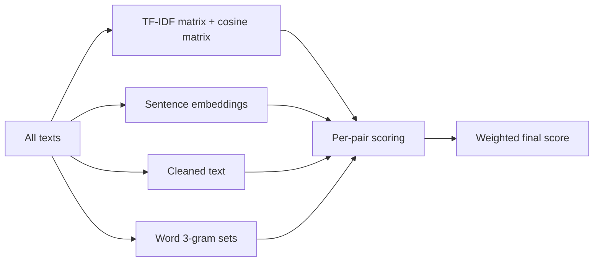
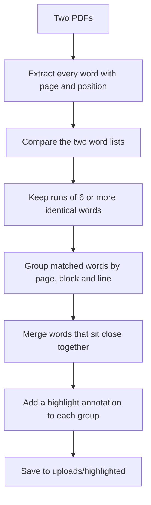

# 🧩 Batch Comparison Flow

> **Written for:** anyone who wants to understand step by step how the app compares student submissions with each other, from clicking *Submit Files* to seeing highlighted PDFs.

This is the main feature of the app. It answers one question: *which submissions in this batch look alike?*

For the web check of a single PDF, see [WEB-PLAGIARISM-FLOW.md](WEB-PLAGIARISM-FLOW.md).

## 🗺️ The whole flow at a glance



## 1️⃣ Upload

**Where:** sidebar in [frontend/app.py](../frontend/app.py), backend route `POST /upload-zip`.

### Frontend checks

| Check | Result |
| --- | --- |
| No ZIP and fewer than 2 PDFs | Error: upload at least two PDFs or a ZIP |
| Both ZIP and PDFs given | Warning, and **only the ZIP is used** |
| Only PDFs given | The frontend packs them into a ZIP in memory, so the backend only ever sees a ZIP |
| Backend unreachable | "Can't connect to backend." |

### Backend steps

1. Save the upload to `uploads/submissions.zip`.
2. Check it is a real ZIP. If not, delete it and return `400`.
3. **Delete the previous batch** (`uploads/submissions/`). Only one batch exists at a time.
4. Extract the ZIP.
5. Delete the ZIP, then run `clean_upload_directory`, which removes:
   - macOS junk files starting with `._`
   - every file that does not end in `.pdf`
   - empty folders left behind

> [!NOTE]
> Files are matched by name only. If two PDFs in different sub-folders of the ZIP share a file name, results and highlighting can mix them up. Use unique names.

After a successful upload, the frontend resets any earlier result and triggers the analysis automatically.

## 2️⃣ Text extraction

**Where:** `POST /analyze` in [backend/app.py](../backend/app.py). The frontend sends two settings from the sidebar.

| Setting | Meaning |
| --- | --- |
| **Pages to ignore from beginning** (`skip_pages`, UI default `1`) | Skips cover pages so shared templates do not inflate scores |
| **OCR Mode** (`ocr_enabled`, `OFF` or `ON`) | `OFF` reads the PDF text layer only. Anything else enables OCR |

The backend walks `uploads/submissions/` (including sub-folders) and, for each `.pdf`:



Details:

- **Valid-PDF check:** the file must start with the bytes `%PDF-`.
- **OCR is per page:** with OCR on, a page is only OCR'd when its text layer has fewer than 30 characters (a scanned image). Normal pages are read directly, which keeps it fast. OCR renders the page at 1.6x scale and uses Tesseract page mode `--psm 6`.
- **Submission name:** the file name without `.pdf`. This is what you see as "Student 1" and "Student 2".
- **Fewer than two usable submissions:** the result is an empty list.

## 3️⃣ Scoring every pair

**Where:** [backend/similarity.py](../backend/similarity.py), called from `calculate_similarity` in `app.py`.

With *n* submissions there are *n(n-1)/2* pairs. The work is split so expensive steps run **once for the whole batch**, not once per pair.



### The four measures

| Measure | Question it answers | How it works | Weight |
| --- | --- | --- | --- |
| **TF-IDF** | Do they use the same important words? | TF-IDF vectors over the whole batch, cosine similarity. Common words that appear in every document count for little | 30% |
| **Semantic** | Do they mean the same thing? | Each text becomes a vector with the `all-MiniLM-L6-v2` model; the dot product of two normalized vectors is their cosine. Negative values become 0 | 40% |
| **N-gram** | Do they share the same phrases? | Split into lowercase words, build every run of 3 consecutive words, then `shared / total distinct` (Jaccard) | 20% |
| **Exact** | Is the text almost identical character by character? | Lowercase, keep only letters and digits, then Python `SequenceMatcher` ratio | 10% |

```text
final = 0.30 x TF-IDF + 0.40 x Semantic + 0.20 x N-gram + 0.10 x Exact
```

Each is a value from 0 to 1, shown as 0-100 and rounded to 2 decimals.

### Worked example (illustrative numbers)

| Measure | Score | Weight | Contribution |
| --- | --- | --- | --- |
| TF-IDF | 40 | 0.30 | 12.0 |
| Semantic | 80 | 0.40 | 32.0 |
| N-gram | 10 | 0.20 | 2.0 |
| Exact | 30 | 0.10 | 3.0 |
| **Final** | | | **49.0** |

### How to read the scores

- **High semantic, low N-gram and exact:** same ideas, different wording (paraphrase, or just the same topic).
- **High N-gram and exact:** shared wording, which is the strongest sign of copying.
- **All four high:** very likely the same text.

### Edge cases handled

- Empty vocabulary (for example only symbols): TF-IDF is skipped and scores 0.
- A text with no content: no embedding is made and its semantic score is 0.
- A text with fewer than 3 words: no 3-grams, so N-gram score is 0.

### Result format

The result is saved to `data/result.json` and returned as:

```json
{ "student1": "alice", "student2": "bob",
  "similarity": { "tfidf": 40.0, "semantic": 80.0, "ngram": 10.0, "exact": 30.0, "final": 49.0 } }
```

## 4️⃣ Overview tab

**Where:** [frontend/app.py](../frontend/app.py) and [frontend/helper.py](../frontend/helper.py).

The frontend turns the pair list into a table and computes everything locally. A pair is **high similarity** when its final score is **above 70%**.

| Item | How it is computed |
| --- | --- |
| Assignments | Worked out backwards from the number of pairs (solving n(n-1)/2) |
| Comparisons | Number of pairs |
| High Similarity | Pairs with final > 70 |
| Average Similarity | Mean of all final scores |
| Similar Students | Students that appear in at least one high pair, with their connection count |
| Distribution chart | Pairs counted in 10-point buckets for the chosen score (Final, TF-IDF, Semantic, N-gram or Exact) |
| Potential Similarity table | High pairs sorted by final score, highest first. The search box keeps rows where either name **starts with** your text. A CSV can be downloaded |
| Interaction network | One dot per student, one line per high pair. Line thickness grows from 70% (thin) to 100% (thick). Hover a line for the score |

The **Last Result** button reloads `data/result.json` through `GET /results`, so you can reopen a previous analysis without re-running it. **clear** calls `POST /clear` and wipes uploads, results and highlights.

## 5️⃣ PDF Comparison tab

Here you inspect *why* two submissions scored high.

1. **Student 1** lists only students that appear in a high pair.
2. **Student 2** lists only that student's high-similarity partners.
3. The final score for the chosen pair is shown as a progress bar.
4. **Generate PDFs** calls `POST /highlights`.

> [!NOTE]
> This tab depends on the Overview tab's table. If you type in the Overview search box, the choices here narrow too.

### How highlighting works

**Where:** [backend/highlight.py](../backend/highlight.py).



1. **Words with positions:** each word is lowercased and stripped of punctuation. Its page and coordinates are stored. Empty results are dropped.
2. **Find matches:** `SequenceMatcher` aligns the two word lists and returns matching runs. Only runs of **6 or more words in a row** count, so single common words and short phrases are ignored.
3. **Group by line:** matched words are grouped by page, text block and line, then ordered left to right.
4. **Merge near words:** words on the same line stay in one highlight if the gap between them is 25 points or less. A bigger gap starts a new highlight.
5. **Draw:** a rectangle around each group becomes a standard PDF highlight annotation, so it works in any PDF viewer.
6. **Save:** both highlighted copies go in `uploads/highlighted/` under their original names. Earlier highlight files are deleted first.

The backend returns the file names plus the number of matching blocks and matched words. The frontend then loads each PDF through `GET /highlighted/{filename}`, shows them side by side and offers downloads.

If a PDF has no extractable text, or no run reaches 6 words, the response contains only a message and the UI finds no files to show.

> [!IMPORTANT]
> Highlighting always reads **all pages**. It ignores the *Pages to ignore* setting, so a shared cover page or template can be highlighted even though it did not affect the score.

## ⚠️ Using the results responsibly

- A high score shows overlap, not intent. Shared assignment briefs, templates, required wording and common sources can all produce it.
- The 70% line is a display threshold set in the frontend, not a verdict. Review the highlighted passages before deciding anything.
- Scanned work depends on OCR quality, which can lower scores.

## 🔎 Quick reference

| Limit or default | Value |
| --- | --- |
| High-similarity threshold | final score > 70% |
| Minimum matching run for highlights | 6 words |
| Highlight merge gap | 25 points |
| Minimum text per file | 10 characters |
| OCR trigger | page text under 30 characters |
| Weights | TF-IDF 30, Semantic 40, N-gram 20, Exact 10 |
| Frontend timeouts | upload 5 min, analysis 30 min, highlights 5 min |
