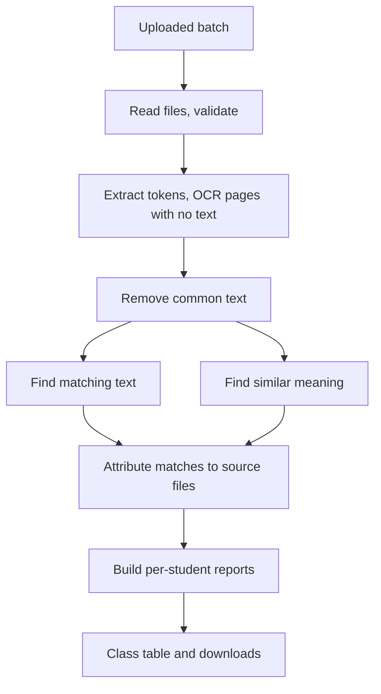

# 🧭 Peer Originality Module: Design Plan

> **Written for:** the project team and reviewers who will build and approve the peer originality module required by the college.

> [!NOTE]
> This is a **plan only**. No code for this module exists yet. Items marked *proposed* are suggestions that still need confirmation.

## 🎯 Goal

Add a module that works like a research-paper plagiarism checker, except the only sources are the **other PDFs in the uploaded batch**.

For every student submission it should:

- break the document into text portions and compare them with every other submission
- highlight matching portions in that student's PDF
- label each highlight with a **number** that cites the source, meaning the other student's file
- report how much of the submission matched, and where

## 🔍 How it differs from what exists

| Existing feature | What it does | Gap |
| --- | --- | --- |
| [Batch comparison](BATCH-COMPARISON-FLOW.md) | One score per **pair** of students; highlights one pair at a time | No per-student report; no numbered source citations |
| [Web check](WEB-PLAGIARISM-FLOW.md) | One PDF against the **internet**, with a numbered, highlighted report | Sources are web pages, not the class |

The new module combines the second one's report style with the first one's data (the uploaded batch). The highlight, badge, report and merge code in `backend/reports.py` can be reused.

## ✅ Decisions so far

| Topic | Decision |
| --- | --- |
| Direction of copying | Not determined. The report says two submissions **match**, not who copied whom |
| Paraphrase | **Included.** Reworded text is detected as well as identical text |
| Skipping pages | **Not used.** Q1, Q2 and Q3 sit on different pages for different students |
| Common text | Removed by content, not by page. The threshold is **adjustable** by the teacher |
| Scanned pages and positions | Matching works on word tokens only. A match that cannot be highlighted is still reported |
| Progress | **Verbose, live** progress for the teacher; no silent background work |
| Percentages | **Separate** percentages for matching text and similar meaning, plus a combined total |
| Storage | **SQLite**, for this module only (agreed) |
| Many students sharing a passage | A passage can appear in **any number** of submissions. All of them are cited as sources and grouped as a copy ring |

## 🧱 Core idea: tokens first, positions second

Each submission becomes one ordered stream of **word tokens** for the whole document. Each token remembers its page number, and its coordinates only when the PDF provides them.

- **Matching** runs on tokens alone, so it does not depend on OCR quality or coordinates.
- **Highlighting** is an extra step, done only for tokens that have coordinates.
- A match with no coordinates is listed in the report as *matched, not highlightable*, with the matched text, the student's page and the source file.

## 🔄 Flow

### 1. Read and validate

Reuse the existing checks: a file must be a real PDF with enough text. Skipped files are reported with the reason.

### 2. Extract tokens

Reuse the existing extraction. Pages with almost no text are read with OCR **automatically**, and the live view says so. If OCR cannot recover text, the page is flagged to the teacher.

### 3. Remove common text

A passage that appears in many submissions is probably the assignment question or a template, so it is not counted as copying.

- The cut-off is an **adjustable setting** ("present in more than X% of the class"), because classes of different sizes behave differently.
- The default must be **high** (*proposed*: well above half the class). Common text means something nearly everyone has, like the question or a template. A passage shared by 4 or 5 students is a possible copy ring and must be reported, not ignored.
- The References section is excluded.
- An optional assignment brief upload can be added as an extra exclusion.
- The report lists what was ignored and why, for example "ignored: appears in 14 of 20 submissions".

### 4. Find matching text (identical or lightly edited)

*Proposed approach:*

1. Cut each token stream into overlapping runs of about 8 words and hash them into one shared index.
2. A hash found in more than one student's file is a candidate match.
3. Extend candidates into the longest continuous runs.
4. Merge runs separated by a small gap, so lightly edited copying is still caught.
5. Drop runs below a minimum length.

This avoids comparing every pair of whole documents word by word, which is slow for large classes. The run length and gap are *proposed* values to be tuned on sample PDFs.

### 5. Find similar meaning (paraphrase)

1. Split each submission into paragraph-sized windows.
2. Compare each window with windows from **other students only**, using sentence embeddings (the project already uses `all-MiniLM-L6-v2`).
3. Flag pairs above a similarity threshold.
4. Skip text already caught as matching text.

The highlight covers the whole paragraph, since there is no exact word span. This detector is the main source of false positives, because students answering the same question can write similar content. The threshold needs tuning on a test set.

### 6. Attribute to sources

- Each matched passage is tied to the file it matches.
- A passage can appear in many submissions (a copy ring of 4, 5 or more students). **Every** other student whose file contains it is listed as a source for that passage; the badge and popup show all of them.
- Students who share passages are clustered into a **match group**, for example "roll_03, roll_07, roll_11, roll_14".
- A group shows who shares the text, not who wrote it first.
- Sources are ranked per report by how much of the student's text they cover.

### 7. Build reports

Per student, mirroring the web check:

- overall percentages: **matching text**, **similar meaning** and **combined** (a passage found by both counts once)
- ranked source list (other students' files) with a percentage each
- the student's match group, if any
- the list of matches, including those that could not be highlighted
- a highlighted PDF with numbered badges and popups naming the source and matched text. Matching text and similar meaning use different colours
- a combined PDF (report plus highlighted document)

## 📺 Live progress for the teacher

The run is a background job, but the UI must show what is happening. The backend records progress and the UI polls it.

| Shown | Example |
| --- | --- |
| Current stage and position | "Stage 3 of 7: extracting text" |
| Current file | "Reading 7 of 20: roll_14.pdf" |
| Running counts | tokens read, passages found, matches so far |
| Warnings as they happen | "roll_09.pdf skipped: not a valid PDF"; "roll_03.pdf page 2 has no text, used OCR"; "roll_11.pdf page 4 has no text and OCR could not read it" |
| Elapsed time and a rolling log | |
| Final summary | files compared, files skipped and why, common text ignored, matches found |

Failures are shown in plain words and never swallowed.

## 💾 Storage with SQLite

*Recommended*, for this module only. It is part of Python's standard library, and `data/` is already a mounted volume.

| Benefit | Why it matters |
| --- | --- |
| Progress survives refresh and restart | The job writes its state to the database |
| Run history | Teachers can reopen earlier runs instead of only the latest |
| Cheap queries | The class table and source lists come from simple queries |
| Caching | Extracted text keyed by file hash lets a re-run skip extraction and OCR |

*Proposed tables:*

| Table | Holds |
| --- | --- |
| `runs` | Settings used (including the common-text cut-off), status, stage, timestamps |
| `submissions` | File name, file hash, token count, skipped reason, warnings |
| `matches` | Student, source student, type, matched text, page, token range, highlightable or not |
| `ignored_common` | Excluded text and how many submissions contained it |
| `events` | The log lines shown in the live view |

Individual tokens are not stored; extracted text per file plus the matches is enough.

> [!IMPORTANT]
> The database holds student work. Treat it like the uploaded PDFs, and make the existing **Clear** action wipe it too.

Enable WAL mode so the job can write while the UI reads. A single backend container is assumed; several backend copies would need a real database server.

## 🕸️ Connectivity graph

A graph that connects PDFs (students) by how much they overlap. The Overview tab already draws a network from the older pairwise scores; this one uses the peer module's data.

| Element | Behaviour |
| --- | --- |
| Node | One per PDF. Size shows the combined percentage; colour shows the match group |
| Edge | A line between two PDFs when their overlap reaches the threshold |
| Threshold | Adjustable slider. Moving it redraws the graph from stored matches in SQLite, with no re-run |
| Edge type toggle | Matching text, similar meaning, or both |
| Click a node | Opens that student's report |
| Click an edge | Lists the passages the two PDFs share and offers the highlighted pair |
| Unconnected nodes | Still shown, so the teacher sees who has no matches |

A copy ring of 4, 5 or more students appears as a connected cluster.

*Proposed* edge strength: the share of the **smaller** document covered by text shared with the other. A short submission copied entirely from a long one then still shows a strong link. The alternative is the raw count of shared words.

## 🖥️ UI changes

- A new tab for the peer report, with a class-wide table of each student's percentages and match group (sortable)
- Selecting a student shows their sources, matches and downloads
- Controls for the common-text cut-off before a run
- The live progress panel described above

## ⚠️ Limits to state to users

- The report cannot say who copied whom, including within a match group. Submission times are not available.
- Similar-meaning matches are a weaker signal than matching text. A teacher should review them.
- Pages that no OCR can read cannot be compared. The report says which.

## ❓ Open questions

- [x] SQLite for this module (agreed)
- [ ] Does the college specify a threshold, report layout or percentage breakdown (for example separating quoted or cited text)?
- [ ] Edge strength for the graph: share of the smaller document (proposed) or raw shared words?
- [ ] Should the existing web check stay as it is?
- [ ] Should the existing pairwise scoring and **PDF Comparison** tab stay, be merged in, or be replaced?
- [ ] Should an assignment brief upload be supported in the first version?
- [ ] Typical batch size? It affects performance choices.

## 🧪 Testing plan

Build a small set of PDFs with known cases: copied, lightly edited, reworded, original, shared question text, and a scanned page. Check each detector against the expected result, then use the set to tune the run length, gap, similar-meaning threshold and common-text cut-off.

## 🗺️ Suggested build order

- [ ] Token extraction with page numbers and optional coordinates
- [ ] Common-text removal with the adjustable cut-off
- [ ] Matching-text detector and attribution
- [ ] SQLite storage and job progress
- [ ] Per-student report and highlighted PDF
- [ ] Verbose progress UI and class table
- [ ] Connectivity graph with threshold slider
- [ ] Similar-meaning detector
- [ ] Test set and tuning
