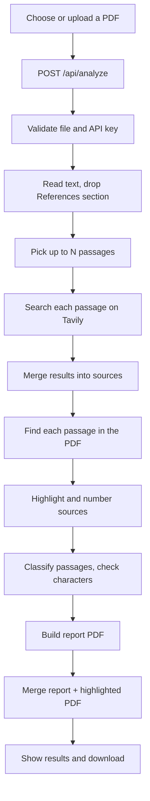
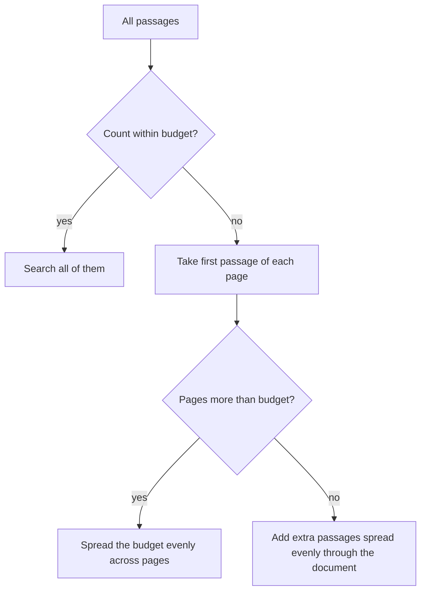

# 🌐 Web Plagiarism Check Flow

> **Written for:** anyone who wants to understand step by step how the app checks a single PDF against the internet and builds its report.

This is the **Plagiarism Report** tab. Unlike the [batch comparison](BATCH-COMPARISON-FLOW.md), it does not compare students with each other. It takes one PDF, searches the web for passages from it, and reports which pages came back.

> [!IMPORTANT]
> The result is **web-search coverage**, not a plagiarism verdict. Only public pages found by the Tavily search API are considered. There is no student-paper database.

## 🗺️ The whole flow at a glance



## 1️⃣ Choose the file

In the tab you either upload a PDF or pick one of the PDFs already chosen in the sidebar. An uploaded file wins over the picked one. **Analyze document** sends it to `POST /api/analyze`.

## 2️⃣ Validation

**Where:** `/api/analyze` in [backend/app.py](../backend/app.py).

| Check | Failure |
| --- | --- |
| File is a PDF (content type or `.pdf` name) | `400` |
| `TAVILY_API_KEY` is set and is not the placeholder `tvly-your-key-here` | `503` |
| File is 25 MB or smaller | `413` |
| PDF has at most 200 pages | error, returned as `502` |
| PDF has selectable text | error: it looks scanned, OCR it first |

Before work starts, **all files from the previous web check are deleted**. Only the latest run exists. If the run fails, the uploaded copy is removed too.

## 3️⃣ Choose what to check

### Skip the References section

The first page that contains a line that is exactly `References`, `Bibliography` or `Works Cited` marks the end of the content. That page and everything after it is excluded. This stops reference lists, which naturally match web pages, from raising the score.

If no such heading exists, all pages are used. The excluded pages are also not highlighted later.

### Cut the text into passages

**Where:** `sentence_chunks` in [backend/reports.py](../backend/reports.py).

For each content page:

1. Split into sentences and keep those of 50 or more characters.
2. Group every **3 sentences** into one passage.
3. Keep passages of 90 or more characters, cut to a maximum of 900.

### Pick which passages to search

Each search costs one Tavily request, so there is a budget (`TAVILY_QUERY_BUDGET`, default 6, allowed 1-18).



The goal is **coverage**: every page gets a chance to be checked before any page gets a second query.

## 4️⃣ Search the web

Each selected passage is sent to Tavily as a query (basic search depth, `TAVILY_MAX_RESULTS` results, default 3, allowed 1-5, 45-second timeout). A failed request stops the run with a `502`.

## 5️⃣ Merge results into sources

Results from all searches are combined by **URL** (any `#fragment` removed). For each URL the app keeps:

- the best search score seen
- the longest text snippet seen
- a list of **matches**: which of your passages returned this URL (up to 8 kept)

Sources are ranked by **how many of your passages returned them**, then by search score.

### Which sentence matched?

A passage is 3 sentences long, so the app picks the single sentence most like the web snippet. Each sentence of 20+ characters gets:

```text
score = 0.7 x (share of its words found in the snippet) + 0.3 x character similarity to the snippet
```

The highest-scoring sentence is stored as that match's `passage`. This is what gets highlighted later.

## 6️⃣ Overall similarity indicator

```text
similarity = passages that returned at least one web result / passages searched x 100
```

Example: 6 passages searched, 3 returned results, so the indicator is 50%. It measures how much of the *sampled* text turned up on the web, not how much of the document is copied.

Each source also gets `match_percentage`: its number of matches divided by the passages searched.

## 7️⃣ Locate sources in the PDF

**Where:** `sources_with_locatable_text` and `match_rectangles` in [backend/reports.py](../backend/reports.py).

A web result is only useful if you can see where it applies. For each source the app tries to find the matched passage on a content page, in this order:

1. Search for the full passage text (if 20+ characters).
2. If not found, search for its first 9 words, then 7, then 5 (each must be 20+ characters).

Sources with **no findable location are dropped** and counted as `unlocated_candidate_sources`. The rest are numbered (1, 2, 3...) and given a colour. The Internet pages count is updated to the number kept.

> [!NOTE]
> The similarity indicator and match groups are calculated before this filtering step and are not recalculated afterwards.

## 8️⃣ Classify the matched passages

Each passage that returned a result is sorted into one of four groups by looking for citation and quotation patterns **inside the passage**:

| | Has quotation marks | No quotation marks |
| --- | --- | --- |
| **Has citation** | 🟢 Cited and quoted | 🟡 Cited without quotation marks |
| **No citation** | 🟠 Quoted without citation | 🔴 Uncited and unquoted |

- **Citation pattern:** text in square brackets (like `[12]`) or in parentheses containing a year from 1900-2099 (like `(Smith, 2019)`).
- **Quotation pattern:** straight or curly quote marks.

The red and orange groups are the ones worth reviewing first. These are pattern checks only: a citation outside the 3-sentence passage is not seen.

## 9️⃣ Integrity flag

The app counts **Cyrillic and Greek characters** in the checked text. Lookalike letters (such as a Cyrillic "а" typed in place of a Latin "a") are a known trick to defeat text matching. The report shows the count and notes that these can be valid in other languages, so context matters.

## 🔟 Build the outputs

All files use the run's unique ID and are stored in `data/results/`.

| Step | Output |
| --- | --- |
| **Highlight** | A copy of your PDF where each matched passage gets a 18%-opacity highlight in its source's colour. Clicking a highlight shows the source URL and the matched passage. A numbered circle in the page margin marks the first highlight of each source on that page. Overlapping spots are only highlighted once |
| **Report** | A PDF with the overall similarity, match groups, source counts, integrity flags and a ranked source list |
| **Combined** | The report followed by the highlighted document, merged into one PDF |

The API returns the full result plus download paths for all three. The UI currently offers only the **combined** PDF as a download.

## 🖥️ What the tab shows

- Overall similarity percentage and how many Tavily requests were used out of the limit
- Match groups with counts and percentages
- Number of internet pages found (publication matches are not identified, submitted works are not searched)
- Integrity flags
- A clickable ranked source list with colour, domain, page title and match percentage
- A note if some candidates were excluded because they could not be located

## ⚠️ Limitations to keep in mind

- Only a **sample** of the document is searched, limited by the query budget. A low score does not prove the rest is original.
- The search returns pages, not proof of copying. Quotes, common definitions and shared facts can all match.
- Scanned PDFs are rejected here; there is no OCR in this flow.
- Raising `TAVILY_QUERY_BUDGET` improves coverage but uses more search requests.

## 🔎 Quick reference

| Limit or default | Value |
| --- | --- |
| Max file size | 25 MB |
| Max pages | 200 |
| Sentence minimum | 50 characters |
| Passage | 3 sentences, 90-900 characters |
| Search budget | `TAVILY_QUERY_BUDGET`, default 6, range 1-18 |
| Results per search | `TAVILY_MAX_RESULTS`, default 3, range 1-5 |
| Matches kept per source | 8 |
| Sources returned | up to 30 |
| Highlight opacity | 18% |
